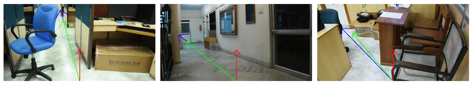

# Navigation
<p align="justify"> Path planning is a very important step for autonomous robot movement, as the robot must be empowered to actuate a movement necessary for navigating in a scene while satisfying certain constraints. Hence, the process of path planning should involve a realistic depiction of the surrounding 3D environment, including the location of obstacles and free space to move within the view field. This task is challenging when presented with only a single RGB view of the scene, without the use of any online depth sensor. In this work, we propose an unsupervised algorithm to compute an optimal direction for maximal unhindered movement in the scene, which will maximize the viewing coverage on the auto-guided mode of traversal, for indoor open-ended scene surveillance applications. Our process combines cues from two deep-learning processes (using input from a single low-end RGB USB-Camera) - semantic segmentation and depth map estimation, to automatically decide plausible robot movement paths while avoiding hindrance posed by objects in the scene. We make assumptions of unavailability of  LIDAR type of 3D sensor, pre-set camera view direction (angle) and field of view, incremental movement of the robot in view field, and then iteratively analyze the scene and progress again, all catering for any open-ended (target-free) surveillance/patrolling applications. Inverse perspective geometry has been used to map the optimal direction estimated in the view field, to that on the floor of the scene for navigation. Results of evaluation using a dataset of videos of scenes captured from indoor (office, labs, meeting/class-rooms, corridors, lounge) environments, reveal the success of the proposed approach. </p>

## Installation & Preparation

#### prerequisites
- Python 3.5
- Pytorch 1.5.1
- Cuda 9.2

#### Installation

Clone the repo and make new virtual enviornment by using [environment.yml](https://github.com/VPLabIMPRINT/NAVIGATION/blob/main/environment.yml)

``` bash
# Clone this repository
git clone https://github.com/VPLabIMPRINT/NAVIGATION.git  

# Go into the repository
cd NAVIGATION

# Deactivating previous environment
conda deactivate

# Creating environment from environment.yml file
conda env create --file environment.yml 

# Activating new enviornment
conda activate navigation_demo 
```


### Model weights
Download following model weights and place it into appropriate folder

- object detection model weights: 
Download weights from [here](https://drive.google.com/drive/folders/1D9_7jCFyLwS0EGy6VP7uXw-22EuhIMkZ?usp=sharing)
and place it into [this](https://github.com/VPLabIMPRINT/NAVIGATION/tree/main/pytorch-0.4-yolov3) folder.

- Depth estimation model weights:
Download weights from [here](https://drive.google.com/file/d/158txNr2sP90FaWkk1q1rBkEwaWNuZJuO/view?usp=sharing)
and place it into [this](https://github.com/VPLabIMPRINT/NAVIGATION/tree/main/Revisiting_Single_Depth_Estimation/pretrained_model)
folder.

- Encoder weights:
Download weights from [here](https://drive.google.com/drive/folders/1QHfpg4FmA5WFT--gGGVloFD7PvVkw-5_?usp=sharing)
and place it into [this](https://github.com/VPLabIMPRINT/NAVIGATION/tree/main/Revisiting_Single_Depth_Estimation/pretrained_model/encoder) folder

- Segmentation model weights:
Download weights from [here](https://drive.google.com/drive/folders/1--uvbvqUgwDilHU60ZuBn1-Jd1-fAxFn?usp=sharing) and place it into [this](https://github.com/VPLabIMPRINT/NAVIGATION/tree/main/semantic-segmentation-pytorch/ckpt/ade20k-mobilenetv2dilated-c1_deepsup_fnf_best) folder.


### Running GUI
``` bash
python fileExp.py
```

### Qualitative Results

